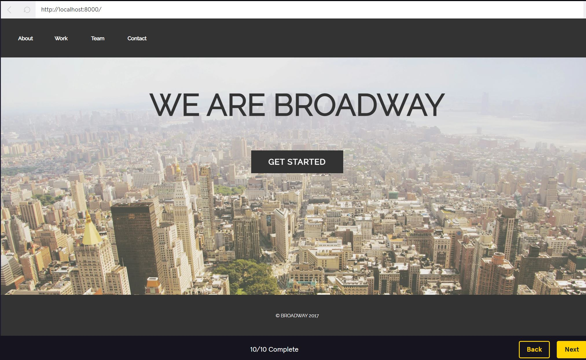
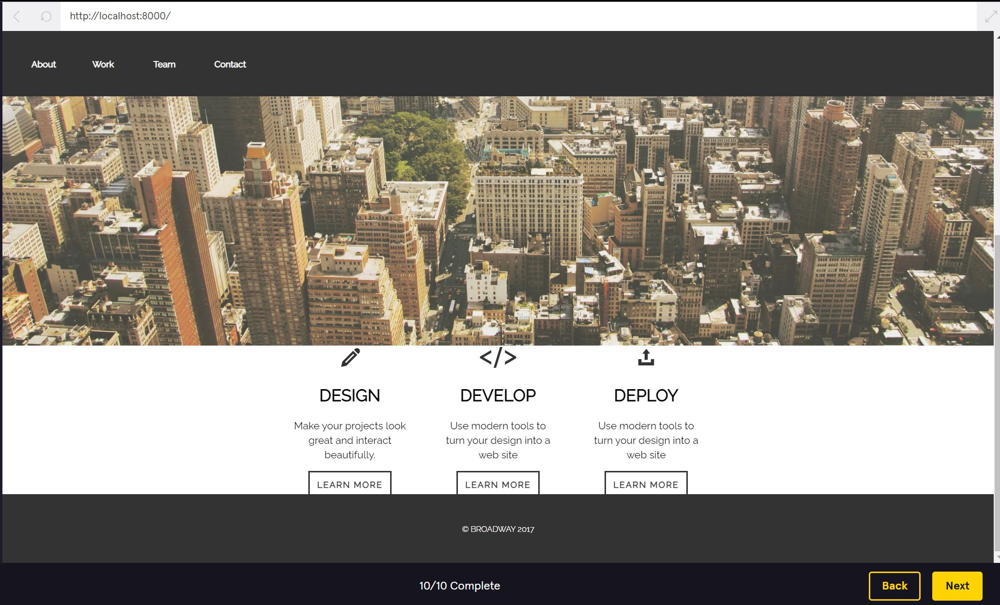

<body>
  <h1>Broadway Project</h1> 
  
In this project, I will use properties such as display and position to improve the layout of the landing page for a fictional design firm, Broadway Design.

  
The site has some style rules to begin with. I will improve the layout and positioning of the navigation menu at the top of the page and the three supporting sections (Design, Develop, Deploy) below the image.

  
  <h3>Website live: </h3>
    
    
</body>
