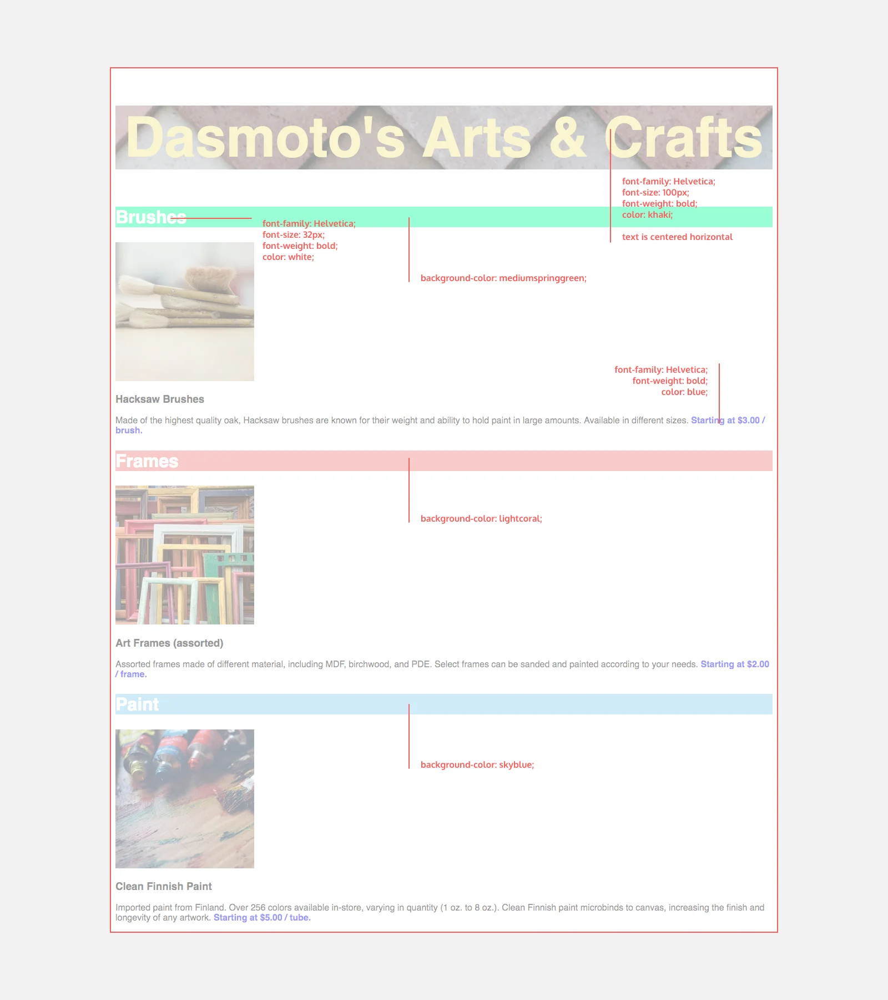

  <h1>Dasomotos Arts and Crafts Project</h1>

  In this project, I will build a simple website for a fictional arts and crafts store using the tools on your own computer. This project will provide me with less guidance than previous projects. I am expected to use the internet, Codecademy, and other resources.
  
At a high-level, this project will require the following:

<ol> 
  <li>A folder structure that makes sense for the project</li>
  <li>An HTML file</li>
  <li>A CSS file</li>
  </ol>  
  
   
  
  <h3>Sample of what my website should look like:</h3>
  

