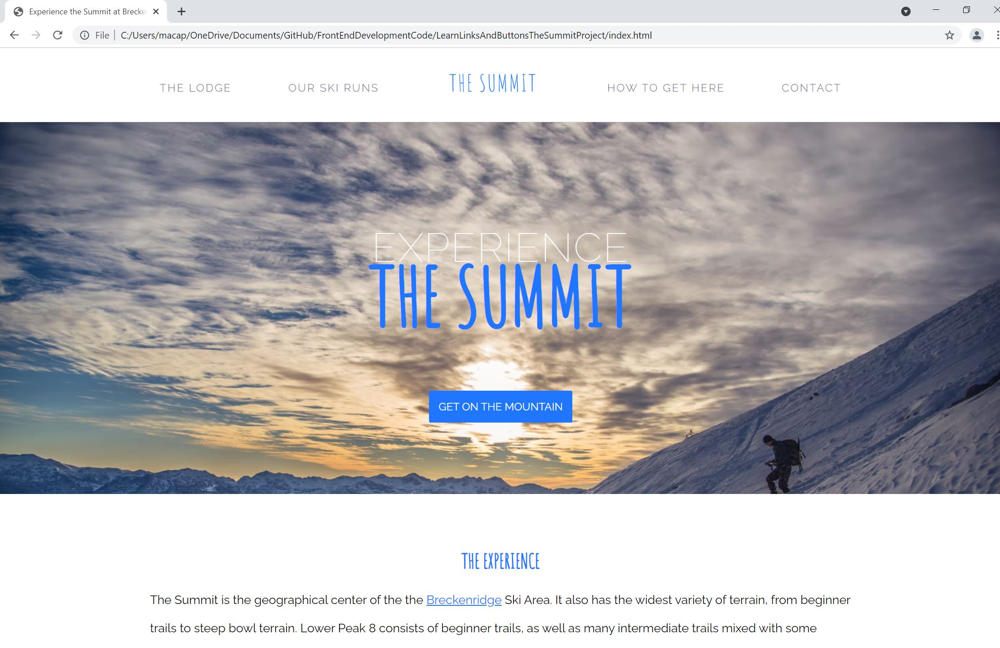

<h1>The Summit Project</h1>

<body>

This is a final project for CodeCademy's Front-End Engineering Course. This session was on learning more about Links and Buttons in CSS.

Time to put some navigation design knowledge to the test! My goal is to improve the user experience of this ski lodge landing page. Currently, none of the clickable elements are very clear or offer good visual feedback to users.

The exact implementation and styling will be up to me; I will take the opportunity to be creative in my designs. Important to note that slick styling is cool, but it is just as important to clearly demonstrate to users how to interact with the site. 

 
 

<h3>Preview of the website live</h3> 

</body>
