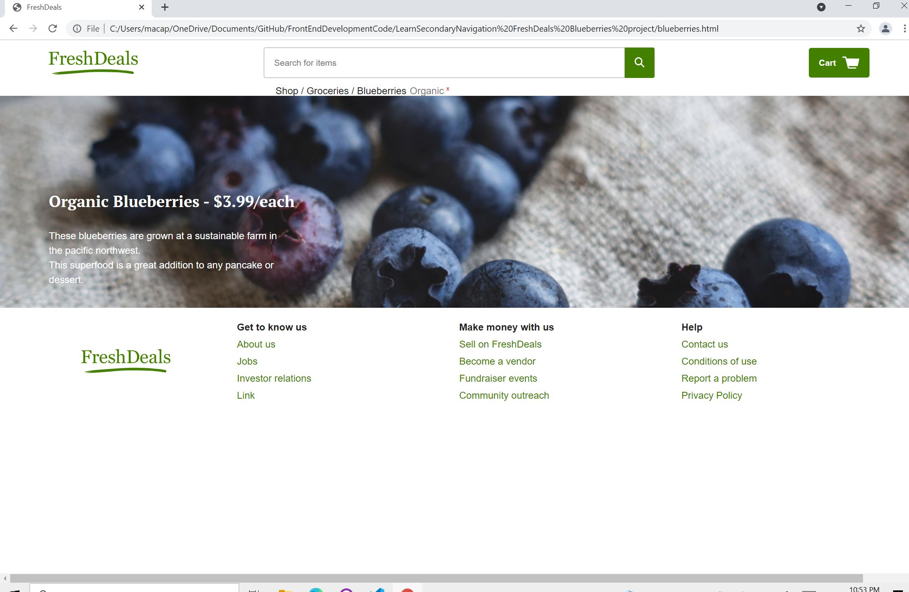

<body>
  <h1>FreshDeals: Blueberries  </h1>

  <h3>This project is from Codecademy's "Learn Secondary Navigation" second in the Front-End Engineering Course.</h3>
  
 
In the browser to the right, there is a site for buying groceries. The currently selected product is “Organic Blueberries”. If you landed on this page, one may have some questions.

Can I buy anything besides blueberries?

Is everything on this site organic or can I buy conventional produce?

Does this site offer non-produce items?

By adding breadcrumbs to this site, I will be adding a UI element that hints to some of the questions above. By doing so, users will have a better feeling for what the site provides and the optional attributes of the product they are purchasing.

 For this project with Codecademy, I am focused on the layout of this page and will be implementing the breadcrumbs via HTML and CSS. The links to the breadcrumbs will not function.

  
  
  <h3>Website Sneak Peek:</h3>
  

</body>
