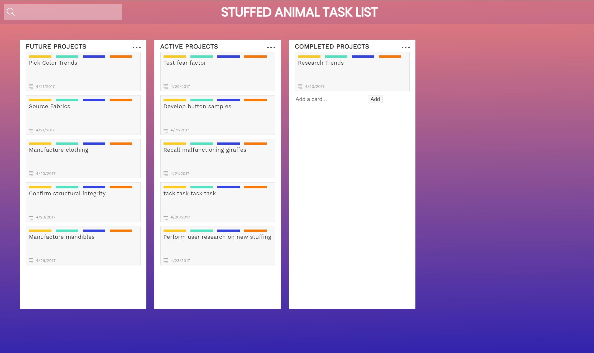

<h1>CSS Grid Task Board page from CodeCademy.</h1>

 In this project, I will create a board of to-do items organized into columns. All of the HTML and most of the CSS have been written for me, but the grid property declarations have yet to be added.

In order to complete this project, I must know how to lay out the structure of a grid’s rows and columns and place items within that grid using CSS.

 

