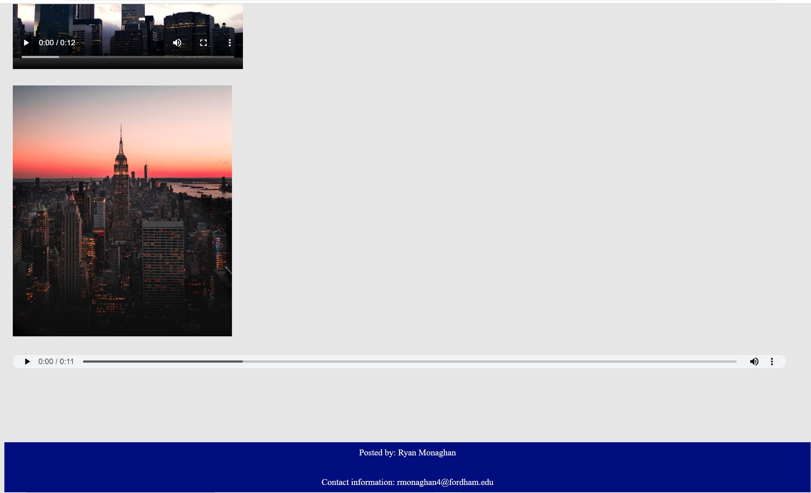

<h1>Ryan's New York City Blog</h1>

After researching New York City, you decide to create a blog for your viewers who want to know more about the city.  
It’s time to create a blog to show off how amazing the Big Apple is.
 

Practice using:

  <ul>
    <li>Audio</li>
    <li>Video</li>
    <li>Embed</li>
    <li>Header</li>
    <li>Body</li>
    <li>Main</li>
    <li>Nav</li>
    <li>Footer</li>
    <li>Section</li>
    <li>Article</li>
    <li>Aside</li>
  </ul>
    
    <h3>Website Snapshots</h3>
    
    
    
    
