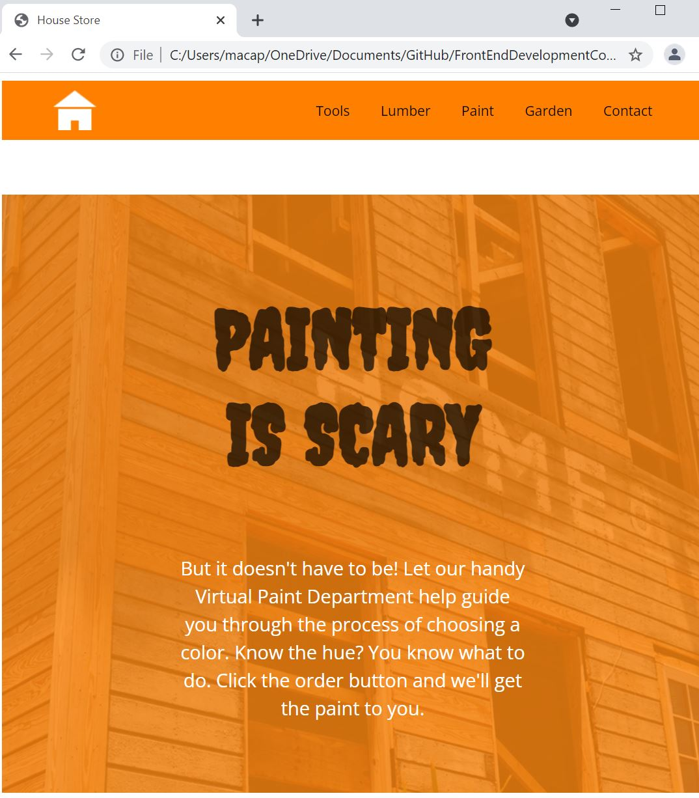

<h1>Paint Store Project</h1>

  
In this project, I follow step-by-step instructions to improve a vibrant, color-rich web page for a home paint business. It displays information about using color in a home and color swatches with varying lightness, saturation, and hue.

The page is almost ready to be published. I will be making the following color-related changes:

  <ol>
    <li>Exchange some named colors with hexadecimal color values</li>
    <li>Add some semi-transparent overlays to the banner and footer using RGBA</li>
    <li>Fill in the first color column of the swatch samples using HSL colors</li>
    <li>The website’s existing index.html and style.css document files are displayed in the text editor</li>
 <ol>

 
 
<h3>Sneak peak of the website: </h3>
  
