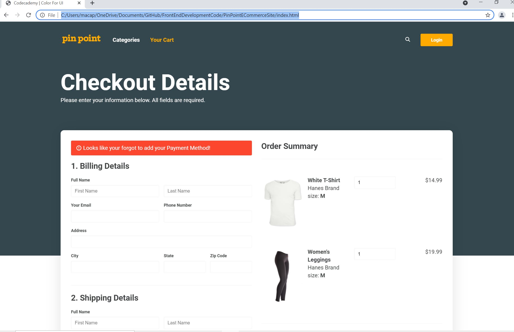

<h1>Pin Point E-Commerce</h1>

<body>

In this project, I use the knowledge I gained within the Color for UI lesson on Codecademy and apply it to an e-commerce checkout page.
 
I will take an existing grayscale website and apply colors to various elements and sections within the design to ensure users understand the error and active states as well as primary calls-to-action.

 This means I will need to consider which elements need to be updated based on providing the user with enough information to continue adding their information to complete their checkout process.

 Also important to use colors that will help them make the right decisions and provide feedback they can adequately act on.

</body>
