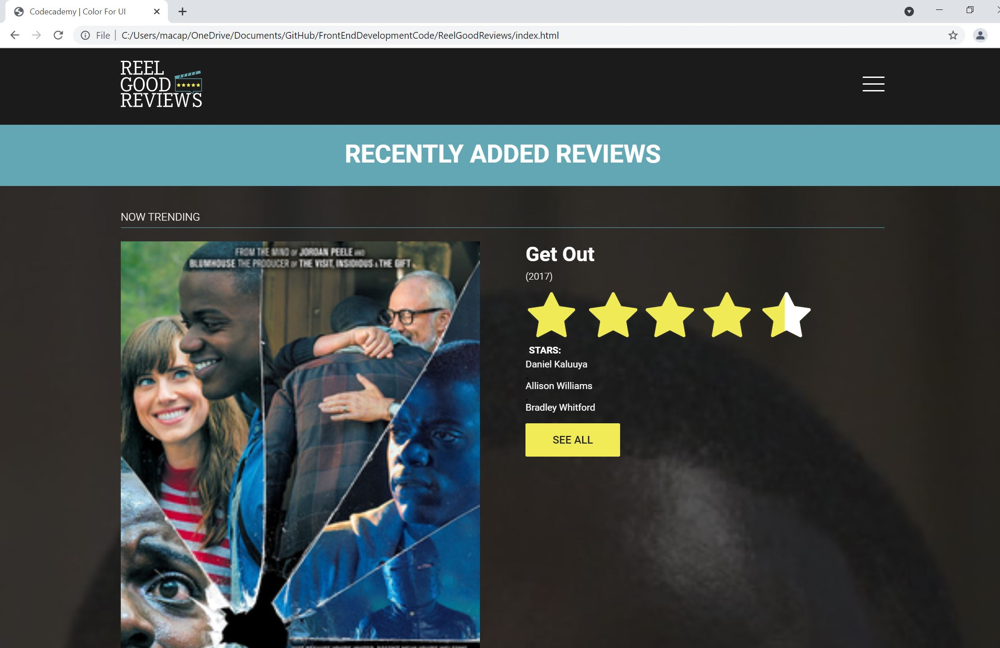

<body>
    <h1>Reel Good Reviews</h1>

Reel Movie Reviews is a popular movie review site that has hired my (imaginary) design company to help improve some of its mobile pages. They have noticed that they are not having users stay on the pages for individual movie reviews very long, and are often not clicking on any of the links to see more content that is present on the pages.

The movie review page for Get Out is shown to the right. I will look through the page and determine how we can improve readability and navigation on this page by improving the text design.

    

This project was a part of Codecademy's "Learn Text Design" portion of the Front-End Engineer Course.

 
 
<h3> Snapshot of the website live:</h3>

</body>
