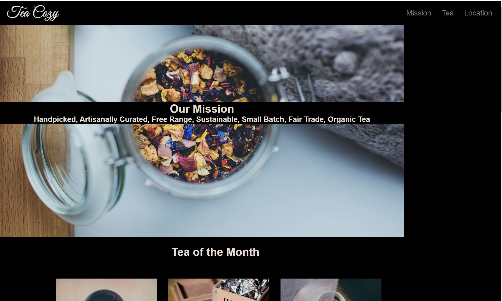

<h2>Off-Platform Project: Tea Cozy Project</h2>
  
In this project, I will create a fictional tea shop website on my own computer.

Codecademy will provide a design spec and image assets to help me along the way. A design spec is an image of a web page outlined with all of its CSS properties and values. 
These are usually created by a designer as a source of instructions for a web developer.
 
 
This project assumes that I will be able to reproduce the basic HTML and CSS with little guidance.

    
    
    
 <h3>Snapshot of the TeaCozy webpage</h3>
 
