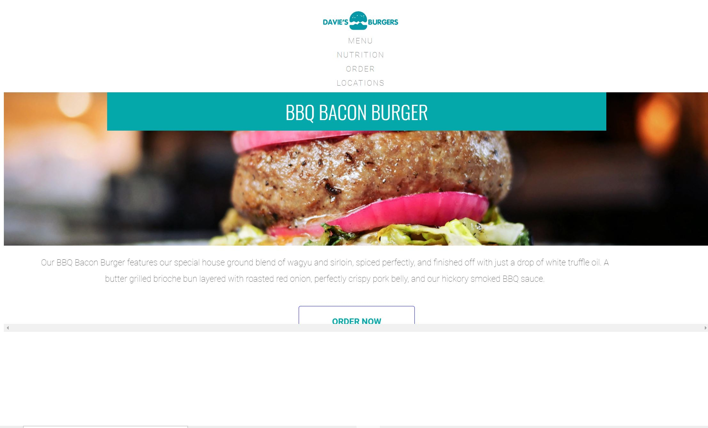
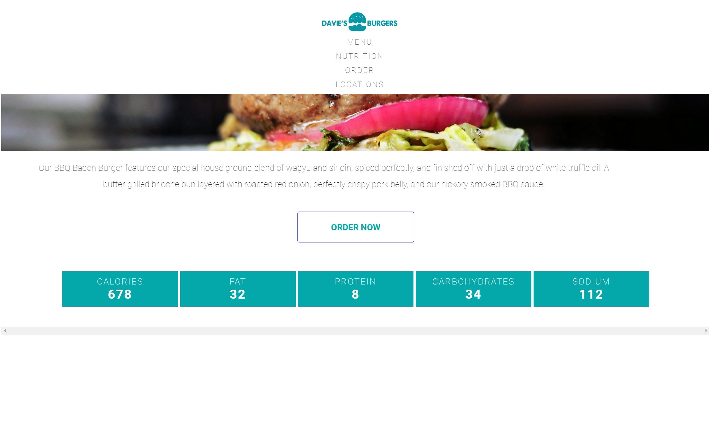

<!DOCTYPE html> 
<html>
<h1>Davie's Burgers (learning the box model)</h1>

<body>
  
In this project, I will follow step-by-step instructions to fix a fictional restaurant’s website. 
     All of the HTML and most of the CSS is intact, but the box model properties have yet to be set. 
      I’ll use my knowledge of height, width, padding, border, and margin to complete this project.

   
   
  
  <h3>What the website looks like live: </h3>
  
  
   
   
  
   

</body>
            </html>
