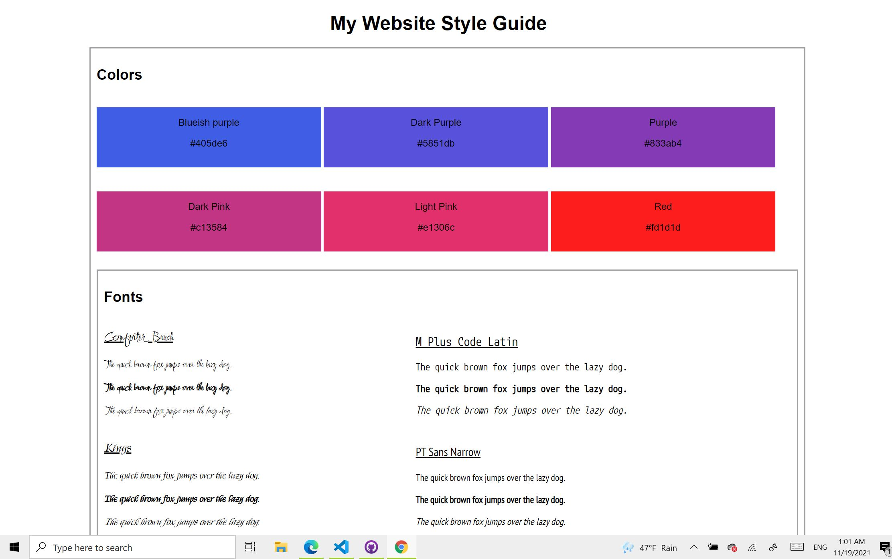

<h1> Build a Website Design System </h1>

This project is slightly different than the others I have encountered thus far on Codecademy.

Instead of a step-by-step tutorial, this project contains a series of open-ended requirements which describe the project I will be building. (see html file for steps)

There are many possible ways to correctly fulfill all of these requirements, and I am expected to use the internet, Codecademy, and other resources when I encounter a problem .

<h3>Snapshot of my Website Design System Page!</h3>

